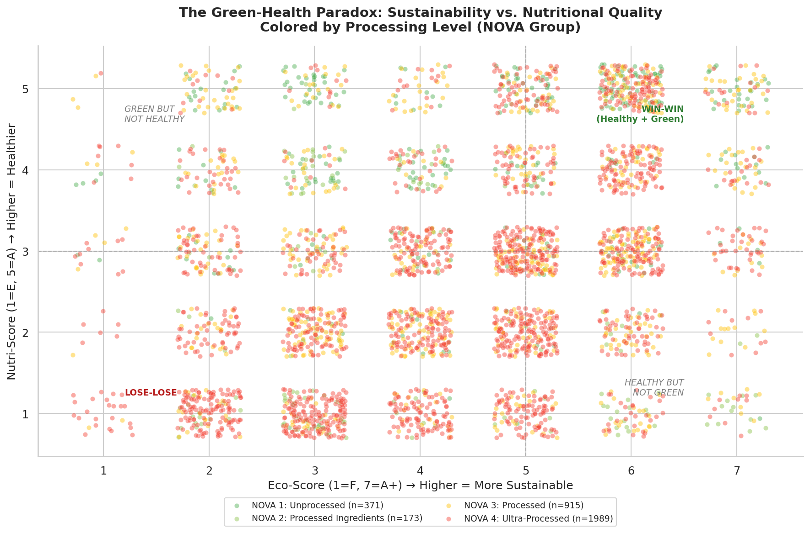
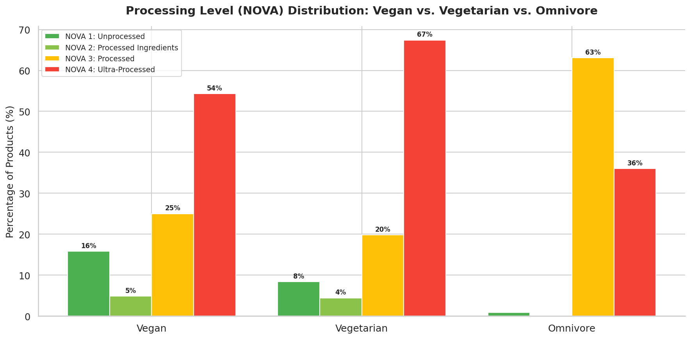
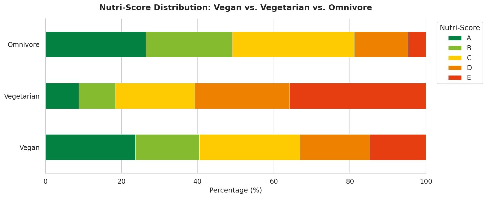
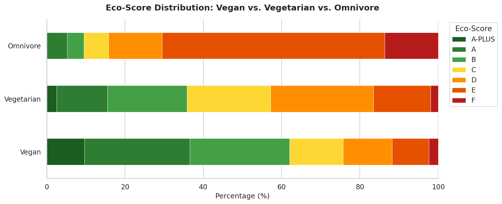
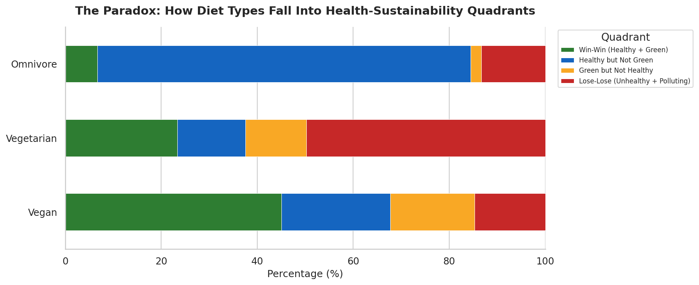
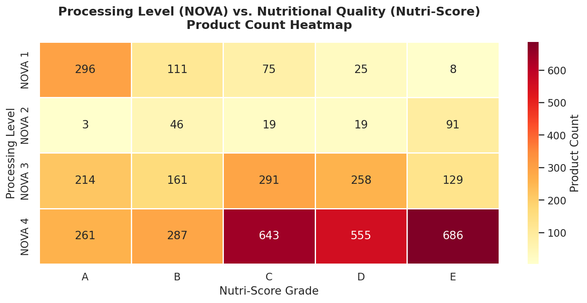
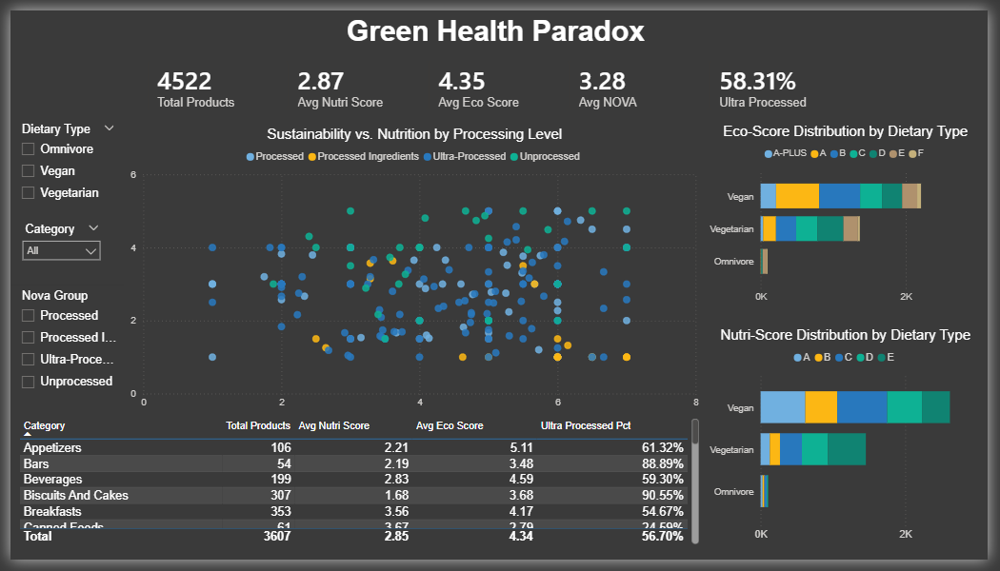

# The Green-Health Paradox
### Is Eating Green the Same as Eating Healthy?

Analysis of 4,522 food products examining the relationship between environmental sustainability (Eco-Score), nutritional quality (Nutri-Score), and processing level (NOVA group) — with a focus on Vegan vs. Non-Vegan products. Built with Python (Pandas, Seaborn, Matplotlib) and SQL. Key finding: 54% of vegan products are ultra-processed (NOVA 4), and while vegan foods score dramatically better on sustainability (62% Eco-Score A/B vs. 9% for omnivore), the "health halo" breaks down when processing level is accounted for.

---

## Business Questions & Answers

### 1. Is eating green the same as eating healthy?

**Answer: No — sustainability and nutrition are two distinct dimensions that often diverge.** Our quadrant analysis classified every product into one of four segments based on median Nutri-Score and Eco-Score cutoffs. Only 36% of products fall into the "Win-Win" quadrant (both healthy and sustainable). Meanwhile, 28% are "Lose-Lose" and 36% fall into paradox zones — either green but nutritionally poor, or healthy but environmentally costly. Consumers and policymakers cannot assume eco-labels guarantee good nutrition.

### 2. Are vegan products healthier and greener than non-vegan alternatives?

**Answer: Greener — yes, dramatically. Healthier — it depends on processing.** Vegan products dominate on Eco-Score: 62% rated A or B versus just 9.5% for omnivore products. But 54% of vegan products are ultra-processed (NOVA 4). The vegan label alone does not guarantee nutritional quality. Meanwhile, 45% of vegan products land in the "Win-Win" quadrant compared to only 7% of omnivore products — so vegan still wins overall, but with a significant processed-food caveat.

### 3. Does processing level explain the gap between sustainability and nutrition?

**Answer: Yes — NOVA group is the hidden variable that bridges the paradox.** Ultra-processed foods (NOVA 4) cluster overwhelmingly in the worst Nutri-Score grades (D and E), regardless of dietary type. Minimally processed foods (NOVA 1) dominate the best grades. This pattern holds for vegan and non-vegan products alike. Processing level is the strongest predictor of nutritional quality, and it cross-cuts the vegan/omnivore divide.

---

## Datasets

- **Source**: [Global Food & Nutrition Database 2026](https://www.kaggle.com/datasets/ahsanneural/global-food-and-nutrition-database-2026) (Kaggle)
- **Primary**: `foods_health_scores_allergens.csv` — 4,997 products with Nutri-Score, Eco-Score, NOVA, allergens, and full nutrition
- **Supplementary**: `comprehensive_foods_usda.csv` — 40,000 USDA products with health scores
- **Supporting**: `foods_dietary_restrictions.csv`, `foods_allergens.csv`, `healthy_foods_database.csv`

## Project Structure

```
the-green-health-paradox/
├── data/
│   ├── foods_health_scores_allergens.csv
│   ├── comprehensive_foods_usda.csv
│   ├── foods_dietary_restrictions.csv
│   ├── foods_allergens.csv
│   └── healthy_foods_database.csv
├── output/
│   ├── green_health_cleaned.csv
│   ├── category_performance.csv
│   ├── paradox_by_dietary_type.csv
│   ├── nova_by_dietary_type.csv
│   ├── nutrition_by_diet.csv
│   └── key_findings.txt
├── visualizations/
│   ├── 01_green_health_scatter.png
│   ├── 02_nova_by_dietary_type.png
│   ├── 03_nutriscore_by_diet.png
│   ├── 04_ecoscore_by_diet.png
│   ├── 05_paradox_quadrants.png
│   ├── 06_nutrition_by_diet.png
│   └── 07_nova_nutriscore_heatmap.png
├── sql_queries/
│   └── analysis_queries.sql
├── analysis.py
└── README.md
```

## Data Cleaning Steps

1. Removed "UNKNOWN" and "NOT-APPLICABLE" labels from Nutri-Score and Eco-Score (not real grades — imputation would bias results)
2. Dropped 475 rows with missing NOVA group (9.5% — acceptable loss)
3. Created **Dietary_Type** column: Vegan (no dairy/eggs/fish), Vegetarian (dairy or eggs, no fish), Omnivore (contains fish)
4. Mapped letter grades to numeric scores for quantitative analysis (Nutri-Score: A=5 to E=1; Eco-Score: A+=7 to F=1)
5. Capped outliers at 99th percentile for energy, fat, sugar, protein, and salt
6. Extracted primary food category from multi-level category strings

## Key Metrics

| Metric | Value |
|--------|------:|
| Products Analyzed | 4,522 |
| Vegan Products | 2,871 (63.5%) |
| Vegan Ultra-Processed Rate | 54.3% |
| Vegetarian Ultra-Processed Rate | 67.4% |
| Vegan Eco-Score A/B | 62.0% |
| Omnivore Eco-Score A/B | 9.5% |
| Win-Win Products (overall) | 35.8% |

## Paradox Quadrants by Diet Type

| Quadrant | Vegan | Vegetarian | Omnivore |
|----------|:-----:|:----------:|:--------:|
| Win-Win (Healthy + Green) | **45.0%** | 23.3% | 6.7% |
| Healthy but Not Green | 22.7% | 14.2% | **77.8%** |
| Green but Not Healthy | 17.6% | 12.7% | 2.2% |
| Lose-Lose | 14.7% | **49.7%** | 13.3% |

## Visualizations

| The Green-Health Scatter | NOVA by Dietary Type |
|:---:|:---:|
|  |  |

| Nutri-Score by Diet | Eco-Score by Diet |
|:---:|:---:|
|  |  |

| Paradox Quadrants | NOVA × Nutri-Score Heatmap |
|:---:|:---:|
|  |  |

## Interactive Dashboard (Power BI)

Built an interactive Power BI dashboard with slicers for Dietary Type, NOVA Group, and Category.
Download the .pbix file from the `dashboard/` folder to explore interactively.



## Skills Demonstrated

- **Python**: Pandas (multi-dataset loading, custom classification logic, crosstabs, quantile-based segmentation), Seaborn, Matplotlib
- **SQL**: CTEs, window functions (RANK, ROW_NUMBER), CASE expressions, cross-tabulations, CROSS JOIN for dynamic thresholds
- **Analytics**: Quadrant analysis, paradox identification, dietary type comparison, nutritional profiling, processing-level stratification
- **Data Cleaning**: Score standardization, categorical encoding, outlier capping, dietary classification from allergen flags
- **Storytelling**: Three executive-level business questions answered with data-driven evidence

## How to Run

```bash
pip install pandas numpy seaborn matplotlib
python analysis.py
```

## Author

**Ernesto** — Data Analyst | Berlin, Germany
